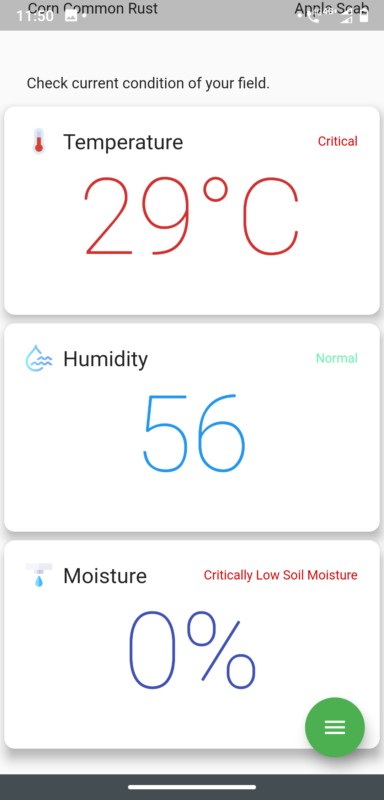
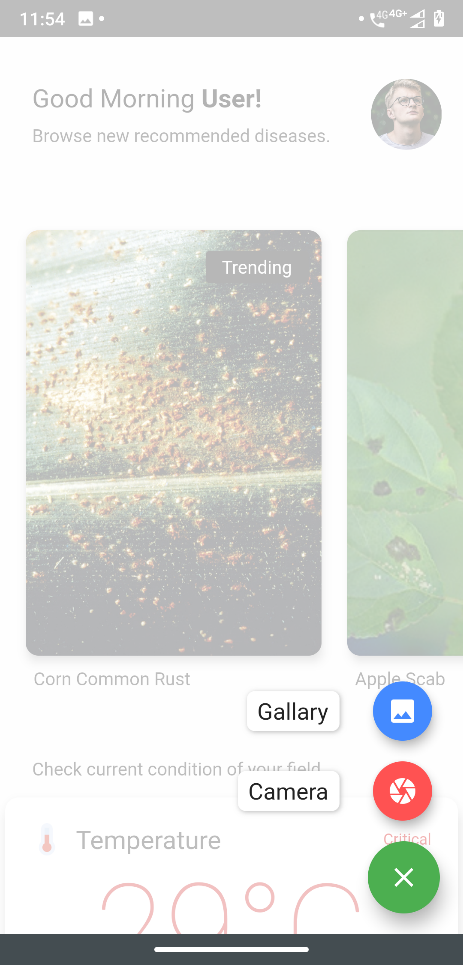
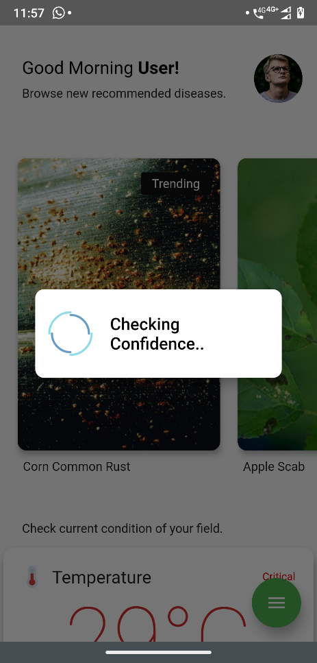
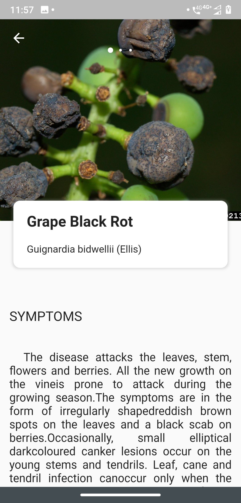

# Intelligent IoT based plant health monitoring and disease detection system

We propose a system which combines internet of things (IoT) based sensing of environmental parameters and image processing to monitor the health of plants along with detecting any diseases associated with it. We are using NodeMCU based IoT device which sends real-time sensor data like air temperature, humidity, soil moisture to the cloud. Image of the affected part of plant is captured and compared to the images in the dataset, wherein using deep learning models the disease is identified. Once a disease is identified, our system will suggest chemicals that are to be used to eradicate the disease. 

### Screenshots:

